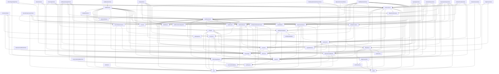

```mermaid
graph TD;
    AntlrCommons-->Utils;
    AntlrCommons-->Antlr4;
    WriterTargetOutput-->Utils;
    WriterTargetOutput-->SwiftSyntax;
    GrammarModelBase-->Utils;
    GrammarModelBase-->Antlr4;
    KnownType-->WriterTargetOutput;
    KnownType-->SwiftAST;
    Intentions-->GrammarModelBase;
    Intentions-->KnownType;
    Intentions-->SwiftAST;
    SwiftSyntaxSupport-->KnownType;
    SwiftSyntaxSupport-->Intentions;
    SwiftSyntaxSupport-->SwiftSyntax;
    SwiftSyntaxSupport-->SwiftSyntaxBuilder;
    SwiftSyntaxSupport-->SwiftAST;
    SwiftSyntaxRewriterPasses-->SwiftSyntaxSupport;
    SwiftSyntaxRewriterPasses-->Utils;
    SwiftSyntaxRewriterPasses-->MiniLexer;
    SwiftSyntaxRewriterPasses-->SwiftSyntax;
    TypeSystem-->ObjcParser;
    TypeSystem-->TypeDefinitions;
    TypeSystem-->Utils;
    TypeSystem-->Intentions;
    TypeSystem-->KnownType;
    TypeSystem-->ObjcGrammarModels;
    TypeSystem-->SwiftAST;
    Commons-->Utils;
    Commons-->TypeSystem;
    Commons-->KnownType;
    Commons-->SwiftAST;
    Analysis-->KnownType;
    Analysis-->Commons;
    Analysis-->Utils;
    Analysis-->Intentions;
    Analysis-->TypeSystem;
    Analysis-->SwiftAST;
    Analysis-->MiniGraphviz;
    IntentionPasses-->Commons;
    IntentionPasses-->Utils;
    IntentionPasses-->MiniLexer;
    IntentionPasses-->Intentions;
    IntentionPasses-->ObjcGrammarModels;
    IntentionPasses-->Analysis;
    IntentionPasses-->SwiftAST;
    ExpressionPasses-->Commons;
    ExpressionPasses-->Utils;
    ExpressionPasses-->Analysis;
    ExpressionPasses-->Intentions;
    ExpressionPasses-->TypeSystem;
    ExpressionPasses-->MiniLexer;
    ExpressionPasses-->SwiftAST;
    SourcePreprocessors-->Utils;
    SourcePreprocessors-->MiniLexer;
    WriterTargetOutputTests-->WriterTargetOutput;
    WriterTargetOutputTests-->TestCommons;
    WriterTargetOutputTests-->SwiftParser;
    GrammarModelBaseTests-->GrammarModelBase;
    IntentionsTests-->Intentions;
    IntentionsTests-->TestCommons;
    IntentionsTests-->SwiftAST;
    KnownTypeTests-->KnownType;
    KnownTypeTests-->TestCommons;
    KnownTypeTests-->WriterTargetOutput;
    KnownTypeTests-->SwiftAST;
    SwiftSyntaxSupportTests-->SwiftSyntaxSupport;
    SwiftSyntaxSupportTests-->KnownType;
    SwiftSyntaxSupportTests-->Intentions;
    SwiftSyntaxSupportTests-->TestCommons;
    SwiftSyntaxSupportTests-->SwiftRewriterLib;
    SwiftSyntaxSupportTests-->SwiftSyntax;
    SwiftSyntaxSupportTests-->SwiftParser;
    SwiftSyntaxSupportTests-->SwiftAST;
    TypeSystemTests-->TypeSystem;
    TypeSystemTests-->ObjcParser;
    TypeSystemTests-->TypeDefinitions;
    TypeSystemTests-->Utils;
    TypeSystemTests-->Intentions;
    TypeSystemTests-->ObjcGrammarModels;
    TypeSystemTests-->KnownType;
    TypeSystemTests-->TestCommons;
    TypeSystemTests-->GlobalsProviders;
    TypeSystemTests-->SwiftAST;
    SwiftSyntaxRewriterPassesTests-->SwiftSyntaxRewriterPasses;
    SwiftSyntaxRewriterPassesTests-->SwiftSyntaxSupport;
    SwiftSyntaxRewriterPassesTests-->TestCommons;
    SwiftSyntaxRewriterPassesTests-->SwiftSyntax;
    SwiftSyntaxRewriterPassesTests-->SwiftParser;
    CommonsTests-->Commons;
    CommonsTests-->KnownType;
    CommonsTests-->SwiftRewriterLib;
    CommonsTests-->TypeSystem;
    CommonsTests-->SwiftAST;
    ExpressionPassesTests-->ExpressionPasses;
    ExpressionPassesTests-->ObjectiveCFrontend;
    ExpressionPassesTests-->SwiftRewriterLib;
    ExpressionPassesTests-->ObjcParser;
    ExpressionPassesTests-->ObjcParserAntlr;
    ExpressionPassesTests-->IntentionPasses;
    ExpressionPassesTests-->GlobalsProviders;
    ExpressionPassesTests-->TypeSystem;
    ExpressionPassesTests-->TestCommons;
    ExpressionPassesTests-->Antlr4;
    ExpressionPassesTests-->SwiftAST;
    SourcePreprocessorsTests-->SourcePreprocessors;
    SourcePreprocessorsTests-->Utils;
    SourcePreprocessorsTests-->SwiftRewriterLib;
    SourcePreprocessorsTests-->IntentionPasses;
    SourcePreprocessorsTests-->GlobalsProviders;
    IntentionPassesTests-->IntentionPasses;
    IntentionPassesTests-->ObjectiveCFrontend;
    IntentionPassesTests-->ObjcGrammarModels;
    IntentionPassesTests-->SwiftRewriterLib;
    IntentionPassesTests-->TestCommons;
    IntentionPassesTests-->GlobalsProviders;
    IntentionPassesTests-->TypeSystem;
    IntentionPassesTests-->SwiftAST;
    AnalysisTests-->Analysis;
    AnalysisTests-->SwiftRewriterLib;
    AnalysisTests-->GlobalsProviders;
    AnalysisTests-->TestCommons;
    AnalysisTests-->TypeSystem;
    AnalysisTests-->SwiftParser;
    AnalysisTests-->SwiftAST;
    AnalysisTests-->MiniGraphviz;
    ObjcParserAntlr-->AntlrCommons;
    ObjcParserAntlr-->Antlr4;
    ObjcGrammarModels-->ObjcParserAntlr;
    ObjcGrammarModels-->GrammarModelBase;
    ObjcGrammarModels-->Utils;
    ObjcParser-->ObjcParserAntlr;
    ObjcParser-->AntlrCommons;
    ObjcParser-->ObjcGrammarModels;
    ObjcParser-->MiniLexer;
    ObjcParser-->Utils;
    ObjcParser-->Antlr4;
    ObjcParser-->TypeLexing;
    GlobalsProviders-->Commons;
    GlobalsProviders-->TypeSystem;
    GlobalsProviders-->SwiftAST;
    ObjectiveCFrontend-->SwiftRewriterLib;
    ObjcParserTests-->ObjcGrammarModels;
    ObjcParserTests-->ObjcParser;
    ObjcParserTests-->TestCommons;
    ObjcGrammarModelsTests-->ObjcGrammarModels;
    GlobalsProvidersTests-->GlobalsProviders;
    GlobalsProvidersTests-->SwiftRewriterLib;
    GlobalsProvidersTests-->TestCommons;
    GlobalsProvidersTests-->TypeSystem;
    GlobalsProvidersTests-->SwiftAST;
    ObjectiveCFrontendTests-->ObjectiveCFrontend;
    ObjectiveCFrontendTests-->TestCommons;
    SwiftRewriter-->SwiftRewriterCLI;
    SwiftRewriter-->SwiftRewriterLib;
    SwiftRewriter-->ExpressionPasses;
    SwiftRewriter-->Utils;
    SwiftRewriter-->SourcePreprocessors;
    SwiftRewriter-->IntentionPasses;
    SwiftRewriter-->MiniLexer;
    SwiftRewriter-->Commons;
    SwiftRewriter-->ObjectiveCFrontend;
    SwiftRewriter-->ObjcParser;
    SwiftRewriter-->ObjcGrammarModels;
    SwiftRewriter-->GlobalsProviders;
    SwiftRewriter-->Console;
    SwiftRewriter-->ArgumentParser;
    SwiftRewriter-->SwiftFormatConfiguration;
    SwiftRewriter-->SwiftAST;
    SwiftRewriterLib-->Analysis;
    SwiftRewriterLib-->TypeDefinitions;
    SwiftRewriterLib-->Utils;
    SwiftRewriterLib-->Intentions;
    SwiftRewriterLib-->TypeSystem;
    SwiftRewriterLib-->IntentionPasses;
    SwiftRewriterLib-->KnownType;
    SwiftRewriterLib-->WriterTargetOutput;
    SwiftRewriterLib-->SwiftSyntaxSupport;
    SwiftRewriterLib-->GlobalsProviders;
    SwiftRewriterLib-->ExpressionPasses;
    SwiftRewriterLib-->SourcePreprocessors;
    SwiftRewriterLib-->SwiftSyntaxRewriterPasses;
    SwiftRewriterLib-->Antlr4;
    SwiftRewriterLib-->Console;
    SwiftRewriterLib-->SwiftFormat;
    SwiftRewriterLib-->SwiftFormatConfiguration;
    SwiftRewriterLib-->SwiftParser;
    SwiftRewriterLib-->SwiftIDEUtils;
    SwiftRewriterLib-->SwiftAST;
    SwiftRewriterCLI-->SwiftRewriterLib;
    SwiftRewriterCLI-->Utils;
    SwiftRewriterCLI-->Console;
    SwiftRewriterCLI-->ArgumentParser;
    TestCommons-->SwiftSyntaxSupport;
    TestCommons-->SwiftRewriterLib;
    TestCommons-->Intentions;
    TestCommons-->KnownType;
    TestCommons-->ObjcGrammarModels;
    TestCommons-->Utils;
    TestCommons-->TypeSystem;
    TestCommons-->ObjectiveCFrontend;
    TestCommons-->MiniLexer;
    TestCommons-->Antlr4;
    TestCommons-->SwiftAST;
    UtilsTests-->Utils;
    SwiftRewriterLibTests-->SwiftRewriterLib;
    SwiftRewriterLibTests-->ObjcGrammarModels;
    SwiftRewriterLibTests-->ObjcParser;
    SwiftRewriterLibTests-->ExpressionPasses;
    SwiftRewriterLibTests-->IntentionPasses;
    SwiftRewriterLibTests-->TestCommons;
    SwiftRewriterLibTests-->GlobalsProviders;
    SwiftRewriterLibTests-->Intentions;
    SwiftRewriterLibTests-->TypeSystem;
    SwiftRewriterLibTests-->WriterTargetOutput;
    SwiftRewriterLibTests-->SwiftSyntaxSupport;
    SwiftRewriterLibTests-->SwiftSyntaxRewriterPasses;
    SwiftRewriterLibTests-->SwiftParser;
    SwiftRewriterLibTests-->SwiftAST;
    TestCommonsTests-->TestCommons;
    TestCommonsTests-->Utils;
    TestCommonsTests-->TypeSystem;
    SwiftRewriterTests-->SwiftRewriter;
```